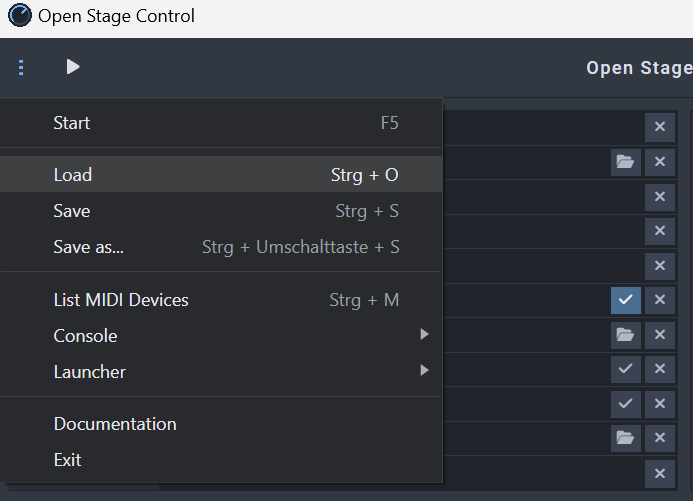
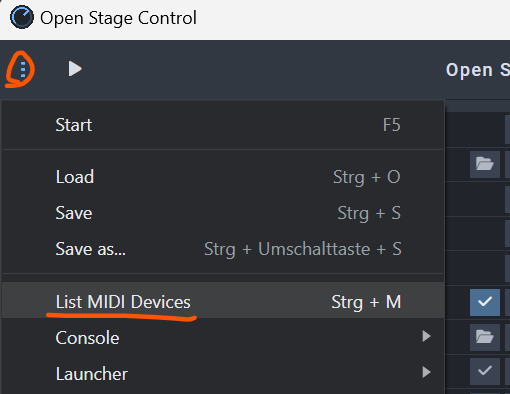
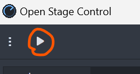
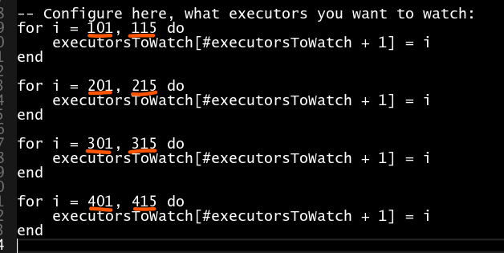

# pam-osc
Controll Grandma3 with Midi Decvices over Open Stage Control and a Plugin to get Feedback for Motorfaders and Button lights.

Features:
- Send Midi Fader Values to Grandma3 Executor on Current Page
- Send Midi Button Values to Grandma3 Executor on Current Page
- It Uses What you see in the Playback (you can configure Master, Speed, Temp, etc. in Grandma)
- Fader Feedback for Motorized Faders
- LED Button Feedback for Running Sequences

## Still in BETA
Everything is still in Beta.
Issues could happen. Please create a [Ticket](https://github.com/xxpasixx/pam-osc/issues) if you find something.

## NOT for Production Purposes
This is not Recomended for Producion Purposes.

It is Still in Beta & uses a lot of Recources, what could create Performance issues during the Show.

## How to Setup

### 1. Install Open Stag Control
You can find it here: [http://openstagecontrol.ammd.net/](http://openstagecontrol.ammd.net/)

### 2. Download Repository
Download Source Code here: [https://github.com/xxpasixx/pam-osc/releases](https://github.com/xxpasixx/pam-osc/releases)

### 3. Configure Open Stage Control
#### Open configuration
Load OpenStageControlConfig.config:

Open Custom Module: pam-OSC-Module.js

#### Configure Midi Devices
List all Midi Devices:

Update the field Midi with your Devices. Exampel: xTouch:0,1

If You have Multiple devices: xTouch:0,1 xTouch2:1,2

### 4. Update Files
Now Open the File pam-OSC-Module.js

Configure your Devices under var routing = {}

Remove the Devices you don't Need.

Set the ip to the IP of your Grandma. Make sure the IP is Session Master.

### 5. Start Open Stage Control

### 6. Configure GrandMA3
#### Make Sure the PC you are Using is Session Master

#### Configure In & - OSC

Make Sure the Right Interface is Selected and the Preferred IP is the same.

Create a new Entry with your Broadcast IP. On Normal Networks it is x.x.x.255

Set the Port to 9003

Set the Fader Range to 127

Set Recive and Recive Command to Yes

Create a Second Entry (Must be number 2) and set your Broadcast IP

Set the Port to 9004

Set the Fader Range to 127

Set Send Command to Yes

In the End it schould look Simular to this:

### 7. Create Plugin
Open the Plugin Pool and create a new One.

Insert a new Lua Component and Edit it.

Paste everything from pam-OSC.lua into it

Save & Close.

Hit the Plugin to Start it.

Now everything should work.

To Disable the Plugin Hit it again.

### 8. Edit Executors (Optional)
Disable the Plugin Loop(Hit it once)

If you want to Edit the Executers that send the Feedback, edit the Start & End Values for ech Row:

The left one is the Start, the right one the End.

Save & Enable the Plugin

## Knewn Limetations
Currently it is only possible to give Midi Feedback for Channel 1.

## Having Troubles ?

### TODO: Create Help for Common Issues